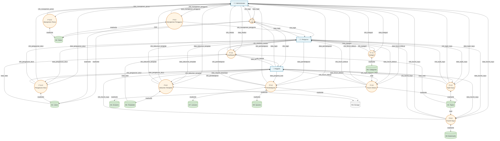

```mermaid
flowchart TB
    %% ==============================================================================
    %% EXTERNAL ENTITIES
    %% ==============================================================================
    Admin["👨‍💼 Administrator"]
    Pengurus["👩‍💼 Pengurus"]
    Anggota["👤 Anggota"]

    %% ==============================================================================
    %% PROCESSES (P1.0 - P11.0)
    %% ==============================================================================
    P1(("P 1.0<br/>Login"))
    P2(("P 2.0<br/>Dashboard"))
    P3(("P 3.0<br/>Forum Diskusi"))
    P4(("P 4.0<br/>Topik Saya"))
    P5(("P 5.0<br/>Pembelajaran"))
    P6(("P 6.0<br/>Dokumen Template"))
    P7(("P 7.0<br/>Kategori"))
    P8(("P 8.0<br/>Favorit Saya"))
    P9(("P 9.0<br/>Manajemen Pengguna"))
    P10(("P 10.0<br/>Manajemen Peran"))
    P11(("P 11.0<br/>Pengaturan Akun"))

    %% ==============================================================================
    %% DATA STORES (Sesuai DFD Level 1)
    %% ==============================================================================
    DS1[("D1: Users")]
    DS2[("D2: Roles")]
    DS3[("D3: Topics")]
    DS4[("D4: Answers")]
    DS5[("D5: Categories")]
    DS6[("D6: Templates")]
    DS7[("D7: Lessons")]
    DS8[("D8: Bookmarks")]
    DS9[("D9: Quizzes")]
    FS[("File Storage")]

    %% ==============================================================================
    %% FLOWS: P 1.0 LOGIN
    %% ==============================================================================
    %% Inputs
    Admin & Pengurus & Anggota -->|data_login| P1
    %% Outputs
    P1 -->|info_login| Admin & Pengurus & Anggota
    %% Data Store Interactions
    P1 <-->|read/write| DS1
    P1 <-->|read| DS2

    %% ==============================================================================
    %% FLOWS: P 2.0 DASHBOARD
    %% ==============================================================================
    %% Inputs (Request)
    Admin & Pengurus & Anggota -->|data_dasbor| P2
    %% Outputs
    P2 -->|info_dasbor| Admin & Pengurus & Anggota
    %% Data Store Interactions
    DS1 & DS3 & DS6 -->|read_stats| P2

    %% ==============================================================================
    %% FLOWS: P 3.0 FORUM DISKUSI
    %% ==============================================================================
    %% Inputs
    Admin & Pengurus & Anggota -->|data_forum_diskusi| P3
    %% Outputs
    P3 -->|info_forum_diskusi| Admin & Pengurus & Anggota
    %% Data Store Interactions
    P3 <-->|read/write| DS3
    P3 <-->|read/write| DS4
    DS5 -->|read| P3

    %% ==============================================================================
    %% FLOWS: P 4.0 TOPIK SAYA
    %% ==============================================================================
    %% Inputs
    Admin & Pengurus & Anggota -->|data_topik_saya| P4
    %% Outputs
    P4 -->|info_topik_saya| Admin & Pengurus & Anggota
    %% Data Store Interactions
    P4 <-->|read/write| DS3

    %% ==============================================================================
    %% FLOWS: P 5.0 PEMBELAJARAN
    %% ==============================================================================
    %% Inputs
    Admin & Pengurus -->|data_pembelajaran| P5
    Anggota -->|data_progress_kuis| P5
    %% Outputs
    P5 -->|info_pembelajaran| Admin & Pengurus & Anggota
    %% Data Store Interactions
    P5 <-->|read/write| DS7
    P5 <-->|read/write| DS9
    P5 <-->|read/write| FS

    %% ==============================================================================
    %% FLOWS: P 6.0 DOKUMEN TEMPLATE
    %% ==============================================================================
    %% Inputs
    Admin & Pengurus -->|data_dokumen_template| P6
    Anggota -->|data_request_download| P6
    %% Outputs
    P6 -->|info_dokumen_template| Admin & Pengurus & Anggota
    %% Data Store Interactions
    P6 <-->|read/write| DS6
    P6 <-->|read/write| FS

    %% ==============================================================================
    %% FLOWS: P 7.0 KATEGORI
    %% ==============================================================================
    %% Inputs
    Admin & Pengurus -->|data_kategori| P7
    %% Outputs
    P7 -->|info_kategori| Admin & Pengurus
    %% Data Store Interactions
    P7 <-->|read/write| DS5

    %% ==============================================================================
    %% FLOWS: P 8.0 FAVORIT SAYA
    %% ==============================================================================
    %% Inputs
    Admin & Pengurus & Anggota -->|data_favorit_saya| P8
    %% Outputs
    P8 -->|info_favorit_saya| Admin & Pengurus & Anggota
    %% Data Store Interactions
    P8 <-->|read/write| DS8
    DS3 -->|read| P8

    %% ==============================================================================
    %% FLOWS: P 9.0 MANAJEMEN PENGGUNA
    %% ==============================================================================
    %% Inputs
    Admin -->|data_manajemen_pengguna| P9
    %% Outputs
    P9 -->|info_manajemen_pengguna| Admin & Pengurus
    %% Data Store Interactions
    P9 <-->|read/write| DS1
    P9 <-->|read/write| DS2

    %% ==============================================================================
    %% FLOWS: P 10.0 MANAJEMEN PERAN
    %% ==============================================================================
    %% Inputs
    Admin -->|data_manajemen_peran| P10
    %% Outputs
    P10 -->|info_manajemen_peran| Admin
    %% Data Store Interactions
    P10 <-->|read/write| DS2

    %% ==============================================================================
    %% FLOWS: P 11.0 PENGATURAN AKUN
    %% ==============================================================================
    %% Inputs
    Admin & Pengurus & Anggota -->|data_pengaturan_akun| P11
    %% Outputs
    P11 -->|info_pengaturan_akun| Admin & Pengurus & Anggota
    %% Data Store Interactions
    P11 <-->|read/write| DS1

    %% ==============================================================================
    %% STYLING
    %% ==============================================================================
    style Admin fill:#E8F4F8,stroke:#2E86AB,stroke-width:2px
    style Pengurus fill:#E8F4F8,stroke:#2E86AB,stroke-width:2px
    style Anggota fill:#E8F4F8,stroke:#2E86AB,stroke-width:2px
    
    style P1 fill:#FFF5E5,stroke:#CC6600,stroke-width:2px
    style P2 fill:#FFF5E5,stroke:#CC6600,stroke-width:2px
    style P3 fill:#FFF5E5,stroke:#CC6600,stroke-width:2px
    style P4 fill:#FFF5E5,stroke:#CC6600,stroke-width:2px
    style P5 fill:#FFF5E5,stroke:#CC6600,stroke-width:2px
    style P6 fill:#FFF5E5,stroke:#CC6600,stroke-width:2px
    style P7 fill:#FFF5E5,stroke:#CC6600,stroke-width:2px
    style P8 fill:#FFF5E5,stroke:#CC6600,stroke-width:2px
    style P9 fill:#FFF5E5,stroke:#CC6600,stroke-width:2px
    style P10 fill:#FFF5E5,stroke:#CC6600,stroke-width:2px
    style P11 fill:#FFF5E5,stroke:#CC6600,stroke-width:2px

    style DS1 fill:#D5E8D4,stroke:#82B366,stroke-width:2px
    style DS2 fill:#D5E8D4,stroke:#82B366,stroke-width:2px
    style DS3 fill:#D5E8D4,stroke:#82B366,stroke-width:2px
    style DS4 fill:#D5E8D4,stroke:#82B366,stroke-width:2px
    style DS5 fill:#D5E8D4,stroke:#82B366,stroke-width:2px
    style DS6 fill:#D5E8D4,stroke:#82B366,stroke-width:2px
    style DS7 fill:#D5E8D4,stroke:#82B366,stroke-width:2px
    style DS8 fill:#D5E8D4,stroke:#82B366,stroke-width:2px
    style DS9 fill:#D5E8D4,stroke:#82B366,stroke-width:2px
    style FS fill:#F8F8F8,stroke:#666666,stroke-width:2px,stroke-dasharray: 5 5
```
