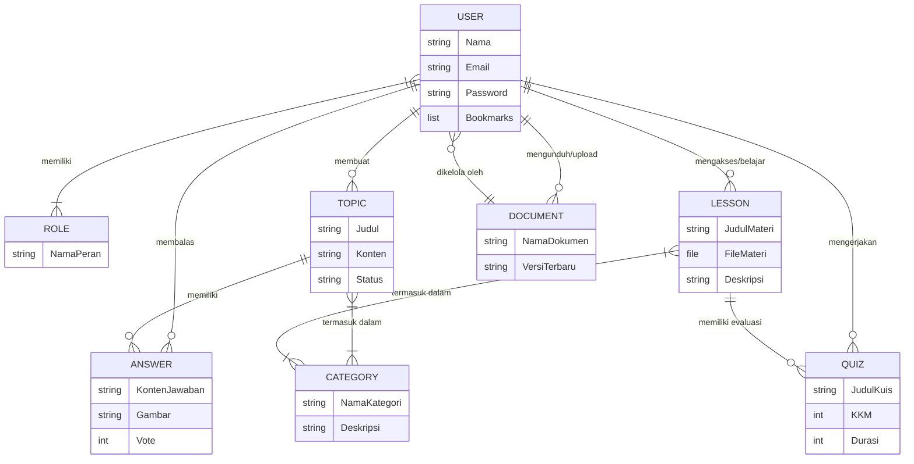

```mermaid
erDiagram
    %% ENTITAS KONSEPTUAL (General Entities)
    %% Fokus pada benda/orang (noun) dan hubungan bisnis

    USER {
        string Nama
        string Email
        string Password
        list Bookmarks
    }

    ROLE {
        string NamaPeran
    }

    TOPIC {
        string Judul
        string Konten
        string Status
    }

    ANSWER {
        string KontenJawaban
        string Gambar
        int Vote
    }

    CATEGORY {
        string NamaKategori
        string Deskripsi
    }

    LESSON {
        string JudulMateri
        file FileMateri
        string Deskripsi
    }

    QUIZ {
        string JudulKuis
        int KKM
        int Durasi
    }

    DOCUMENT {
        string NamaDokumen
        string VersiTerbaru
    }

    %% HUBUNGAN ANTAR ENTITAS (Relationships)

    USER ||--o{ TOPIC : "membuat"
    USER ||--o{ ANSWER : "membalas"
    USER ||--o{ LESSON : "mengakses/belajar"
    USER ||--o{ QUIZ : "mengerjakan"
    USER ||--o{ DOCUMENT : "mengunduh/upload"
    USER }|--|{ ROLE : "memiliki"

    TOPIC }|--|{ CATEGORY : "termasuk dalam"
    TOPIC ||--o{ ANSWER : "memiliki"

    LESSON }|--|{ CATEGORY : "termasuk dalam"
    LESSON ||--o{ QUIZ : "memiliki evaluasi"

    DOCUMENT ||--o{ USER : "dikelola oleh"
```
