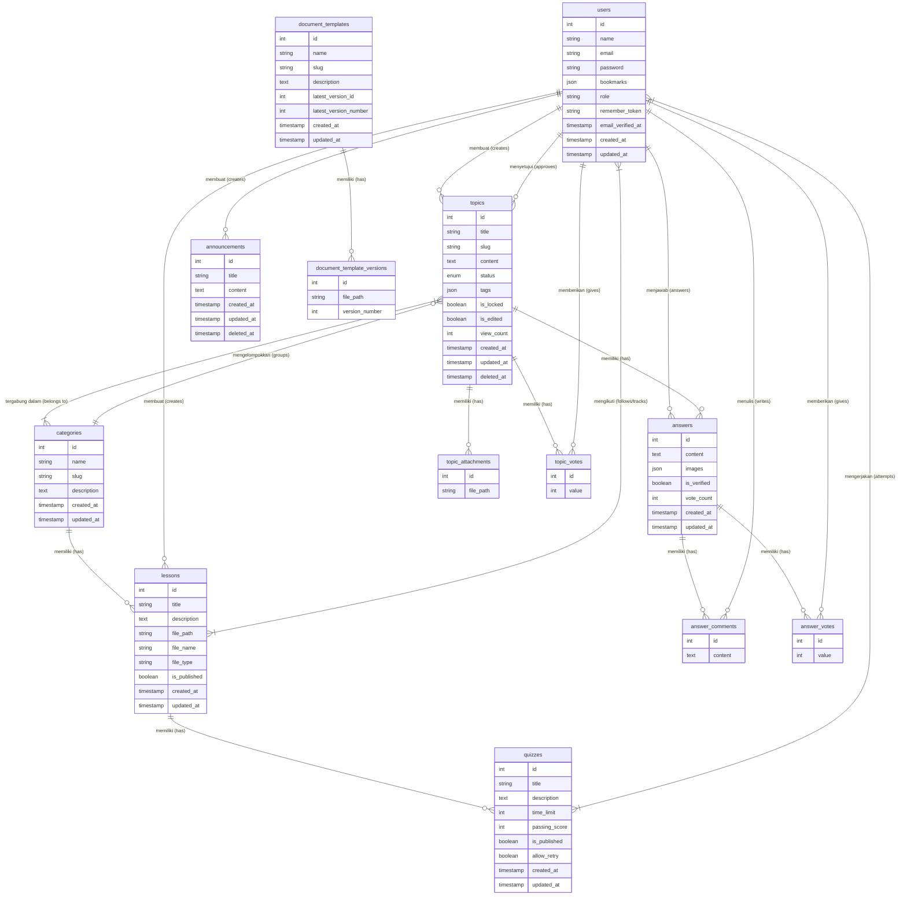

```mermaid
erDiagram
    %% ================================================================================
    %% ERD KONSEPTUAL - SISTEM LMS
    %% Berdasarkan Deskripsi_ERD_Konseptual.txt
    %% ================================================================================

    %% 1. ENTITAS
    users {
        int id
        string name
        string email
        string password
        json bookmarks
        string role
        string remember_token
        timestamp email_verified_at
        timestamp created_at
        timestamp updated_at
    }

    topics {
        int id
        string title
        string slug
        text content
        enum status
        json tags
        boolean is_locked
        boolean is_edited
        int view_count
        timestamp created_at
        timestamp updated_at
        timestamp deleted_at
    }

    categories {
        int id
        string name
        string slug
        text description
        timestamp created_at
        timestamp updated_at
    }

    answers {
        int id
        text content
        json images
        boolean is_verified
        int vote_count
        timestamp created_at
        timestamp updated_at
    }

    lessons {
        int id
        string title
        text description
        string file_path
        string file_name
        string file_type
        boolean is_published
        timestamp created_at
        timestamp updated_at
    }

    quizzes {
        int id
        string title
        text description
        int time_limit
        int passing_score
        boolean is_published
        boolean allow_retry
        timestamp created_at
        timestamp updated_at
    }

    document_templates {
        int id
        string name
        string slug
        text description
        int latest_version_id
        int latest_version_number
        timestamp created_at
        timestamp updated_at
    }

    announcements {
        int id
        string title
        text content
        timestamp created_at
        timestamp updated_at
        timestamp deleted_at
    }

    %% Entitas Tambahan dari Bagian Relasi
    topic_attachments {
        int id
        string file_path
    }

    topic_votes {
        int id
        int value
    }

    answer_comments {
        int id
        text content
    }

    answer_votes {
        int id
        int value
    }

    document_template_versions {
        int id
        string file_path
        int version_number
    }

    %% 2. RELASI

    %% 1. users MEMBUAT topics
    users ||--o{ topics : "membuat (creates)"

    %% 2. users MENYETUJUI topics
    users ||--o{ topics : "menyetujui (approves)"

    %% 3. users MENJAWAB answers
    users ||--o{ answers : "menjawab (answers)"

    %% 4. topics MEMILIKI answers
    topics ||--o{ answers : "memiliki (has)"

    %% 5 & 6. categories dan topics
    categories ||--o{ topics : "mengelompokkan (groups)"
    topics }|--|{ categories : "tergabung dalam (belongs to)"

    %% 7. lessons TERGABUNG DALAM categories
    categories ||--o{ lessons : "memiliki (has)"

    %% 8. users MEMBUAT lessons
    users ||--o{ lessons : "membuat (creates)"

    %% 9. lessons MEMILIKI quizzes
    lessons ||--o{ quizzes : "memiliki (has)"

    %% 10. users MENGIKUTI lessons (Progress)
    users }|--|{ lessons : "mengikuti (follows/tracks)"

    %% 11. users MENGERJAKAN quizzes (Attempts)
    users }|--|{ quizzes : "mengerjakan (attempts)"

    %% 12. topics MEMILIKI attachments
    topics ||--o{ topic_attachments : "memiliki (has)"

    %% 13. topics MEMILIKI votes
    topics ||--o{ topic_votes : "memiliki (has)"
    users ||--o{ topic_votes : "memberikan (gives)"

    %% 14. answers MEMILIKI comments
    answers ||--o{ answer_comments : "memiliki (has)"
    users ||--o{ answer_comments : "menulis (writes)"

    %% 15. answers MEMILIKI votes
    answers ||--o{ answer_votes : "memiliki (has)"
    users ||--o{ answer_votes : "memberikan (gives)"

    %% 16. document_templates MEMILIKI versions
    document_templates ||--o{ document_template_versions : "memiliki (has)"

    %% 17. users MEMBUAT announcements
    users ||--o{ announcements : "membuat (creates)"

```
