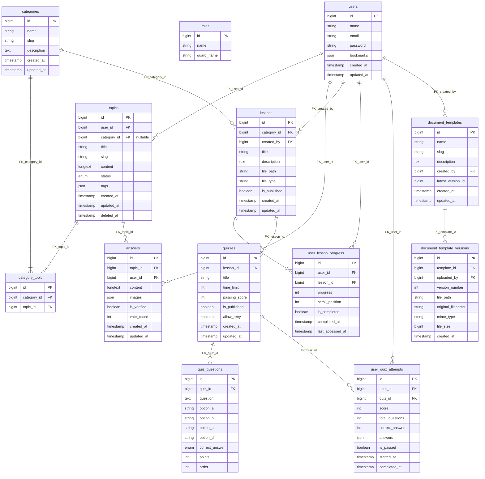

```mermaid
erDiagram
    %% ENTITAS LOGIS (Logical Tables)
    %% Merepresentasikan struktur database aktual dengan PK/FK

    users {
        bigint id PK
        string name
        string email
        string password
        json bookmarks
        timestamp created_at
        timestamp updated_at
    }

    roles {
        bigint id PK
        string name
        string guard_name
    }

    categories {
        bigint id PK
        string name
        string slug
        text description
        timestamp created_at
        timestamp updated_at
    }

    topics {
        bigint id PK
        bigint user_id FK
        bigint category_id FK "nullable"
        string title
        string slug
        longtext content
        enum status
        json tags
        timestamp created_at
        timestamp updated_at
        timestamp deleted_at
    }

    category_topic {
        bigint id PK
        bigint category_id FK
        bigint topic_id FK
    }

    answers {
        bigint id PK
        bigint topic_id FK
        bigint user_id FK
        longtext content
        json images
        boolean is_verified
        int vote_count
        timestamp created_at
        timestamp updated_at
    }

    lessons {
        bigint id PK
        bigint category_id FK
        bigint created_by FK
        string title
        text description
        string file_path
        string file_type
        boolean is_published
        timestamp created_at
        timestamp updated_at
    }

    user_lesson_progress {
        bigint id PK
        bigint user_id FK
        bigint lesson_id FK
        int progress
        int scroll_position
        boolean is_completed
        timestamp completed_at
        timestamp last_accessed_at
    }

    quizzes {
        bigint id PK
        bigint lesson_id FK
        string title
        int time_limit
        int passing_score
        boolean is_published
        boolean allow_retry
        timestamp created_at
        timestamp updated_at
    }

    quiz_questions {
        bigint id PK
        bigint quiz_id FK
        text question
        string option_a
        string option_b
        string option_c
        string option_d
        enum correct_answer
        int points
        int order
    }

    user_quiz_attempts {
        bigint id PK
        bigint user_id FK
        bigint quiz_id FK
        int score
        int total_questions
        int correct_answers
        json answers
        boolean is_passed
        timestamp started_at
        timestamp completed_at
    }

    document_templates {
        bigint id PK
        string name
        string slug
        text description
        bigint created_by FK
        bigint latest_version_id
        timestamp created_at
        timestamp updated_at
    }

    document_template_versions {
        bigint id PK
        bigint template_id FK
        bigint uploaded_by FK
        int version_number
        string file_path
        string original_filename
        string mime_type
        bigint file_size
        timestamp created_at
    }

    %% RELATIONS (Logis dengan Kardinalitas)
    
    users ||--o{ topics : "FK_user_id"
    users ||--o{ answers : "FK_user_id"
    users ||--o{ lessons : "FK_created_by"
    users ||--o{ user_lesson_progress : "FK_user_id"
    users ||--o{ user_quiz_attempts : "FK_user_id"
    users ||--o{ document_templates : "FK_created_by"

    %% Many-to-Many via Pivot for Topics-Categories (Schema allows both direct and pivot, primarily pivot for multiple)
    categories ||--|{ category_topic : "FK_category_id"
    topics ||--|{ category_topic : "FK_topic_id"
    
    %% Direct relation falling back if needed, but pivot is clearer
    topics ||--o{ answers : "FK_topic_id"

    categories ||--o{ lessons : "FK_category_id"

    lessons ||--o{ user_lesson_progress : "FK_lesson_id"
    lessons ||--o{ quizzes : "FK_lesson_id"

    quizzes ||--o{ quiz_questions : "FK_quiz_id"
    quizzes ||--o{ user_quiz_attempts : "FK_quiz_id"

    document_templates ||--o{ document_template_versions : "FK_template_id"
```
