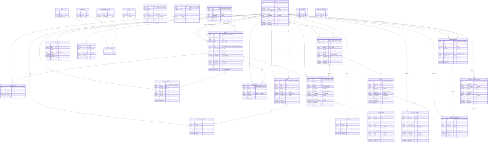

```mermaid
erDiagram
    %% ================================================================================
    %% ERD LOGIS - SISTEM LMS
    %% Berdasarkan Deskripsi_ERD_Logis.txt
    %% ================================================================================

    %% 1. users
    users {
        bigint id PK "unsigned, auto_increment"
        varchar name
        varchar email "unique"
        timestamp email_verified_at "nullable"
        varchar password
        json bookmarks "nullable"
        varchar role
        varchar remember_token "nullable"
        timestamp created_at
        timestamp updated_at
    }

    %% 2. topics
    topics {
        bigint id PK "unsigned, auto_increment"
        bigint user_id FK
        varchar title "255"
        varchar slug "255, unique"
        longtext content
        enum status "'submitted','approved','rejected' default='submitted'"
        bigint approved_by FK "nullable"
        bigint category_id FK "nullable"
        json tags "nullable"
        boolean is_locked "default=false"
        boolean is_edited "default=false"
        bigint edited_by FK "nullable"
        integer view_count "default=0"
        timestamp created_at
        timestamp updated_at
        timestamp deleted_at "nullable, soft delete"
    }

    %% 3. categories
    categories {
        bigint id PK "unsigned, auto_increment"
        varchar name
        varchar slug "unique"
        text description "nullable"
        timestamp created_at
        timestamp updated_at
    }

    %% 4. category_topic
    category_topic {
        bigint id PK "unsigned, auto_increment"
        bigint category_id FK
        bigint topic_id FK
        timestamp created_at
        timestamp updated_at
    }

    %% 5. answers
    answers {
        bigint id PK "unsigned, auto_increment"
        bigint topic_id FK
        bigint user_id FK
        longtext content
        json images "nullable"
        boolean is_verified "default=false"
        bigint verified_by FK "nullable"
        integer vote_count "default=0"
        timestamp created_at
        timestamp updated_at
    }

    %% 6. answer_comments
    answer_comments {
        bigint id PK "unsigned, auto_increment"
        bigint answer_id FK
        bigint user_id FK
        text content
        timestamp created_at
        timestamp updated_at
    }

    %% 7. answer_votes
    answer_votes {
        bigint id PK "unsigned, auto_increment"
        bigint answer_id FK
        bigint user_id FK
        tinyint vote "1 (up) or -1 (down)"
        timestamp created_at
        timestamp updated_at
    }

    %% 8. topic_attachments
    topic_attachments {
        bigint id PK "unsigned, auto_increment"
        bigint topic_id FK
        bigint uploaded_by FK
        varchar file_path
        varchar file_type
        integer file_size
        timestamp created_at
        timestamp updated_at
    }

    %% 9. topic_votes
    topic_votes {
        bigint id PK "unsigned, auto_increment"
        bigint topic_id FK
        bigint user_id FK
        tinyint vote "1 (up) or -1 (down)"
        timestamp created_at
        timestamp updated_at
    }

    %% 10. lessons
    lessons {
        bigint id PK "unsigned, auto_increment"
        varchar title
        text description "nullable"
        bigint category_id FK "nullable"
        varchar file_path
        varchar file_name
        varchar file_type "pdf, doc, docx"
        bigint created_by FK
        boolean is_published "default=false"
        timestamp created_at
        timestamp updated_at
    }

    %% 11. quizzes
    quizzes {
        bigint id PK "unsigned, auto_increment"
        bigint lesson_id FK
        varchar title
        text description "nullable"
        integer time_limit "minutes, nullable"
        integer passing_score "default=70"
        boolean is_published "default=false"
        boolean allow_retry "default=true"
        timestamp created_at
        timestamp updated_at
    }

    %% 12. quiz_questions
    quiz_questions {
        bigint id PK "unsigned, auto_increment"
        bigint quiz_id FK
        text question
        varchar option_a
        varchar option_b
        varchar option_c "nullable"
        varchar option_d "nullable"
        enum correct_answer "'a','b','c','d'"
        integer points "default=1"
        integer order "default=0"
        timestamp created_at
        timestamp updated_at
    }

    %% 13. user_quiz_attempts
    user_quiz_attempts {
        bigint id PK "unsigned, auto_increment"
        bigint user_id FK
        bigint quiz_id FK
        integer score "default=0"
        integer total_questions
        integer correct_answers "default=0"
        json answers "nullable"
        timestamp started_at
        timestamp completed_at "nullable"
        boolean is_passed "default=false"
        timestamp created_at
        timestamp updated_at
    }

    %% 14. user_lesson_progress
    user_lesson_progress {
        bigint id PK "unsigned, auto_increment"
        bigint user_id FK
        bigint lesson_id FK
        integer progress "0-100, default=0"
        integer scroll_position "default=0"
        integer time_spent "seconds, default=0"
        boolean is_completed "default=false"
        timestamp started_at "nullable"
        timestamp completed_at "nullable"
        timestamp last_accessed_at "nullable"
        timestamp created_at
        timestamp updated_at
    }

    %% 15. document_templates
    document_templates {
        bigint id PK "unsigned, auto_increment"
        varchar name
        varchar slug "unique"
        text description "nullable"
        bigint latest_version_id "nullable"
        integer latest_version_number "unsigned, default=0"
        bigint created_by FK
        bigint updated_by FK "nullable"
        timestamp created_at
        timestamp updated_at
    }

    %% 16. document_template_versions
    document_template_versions {
        bigint id PK "unsigned, auto_increment"
        bigint template_id FK
        integer version_number "unsigned"
        varchar file_path
        varchar original_filename
        varchar mime_type
        bigint file_size "unsigned"
        bigint uploaded_by FK
        timestamp created_at
        timestamp updated_at
    }

    %% 17. document_template_logs
    document_template_logs {
        bigint id PK "unsigned, auto_increment"
        bigint template_id FK
        bigint version_id FK
        bigint user_id FK
        timestamp downloaded_at
        varchar ip_address "45, nullable"
        timestamp created_at
        timestamp updated_at
    }

    %% 18. announcements
    announcements {
        bigint id PK "unsigned, auto_increment"
        varchar title
        text content
        bigint user_id FK "nullable"
        timestamp created_at
        timestamp updated_at
        timestamp deleted_at "nullable"
    }

    %% 19. sessions
    sessions {
        varchar id PK
        bigint user_id FK "nullable"
        varchar ip_address "45, nullable"
        text user_agent "nullable"
        longtext payload
        integer last_activity
    }

    %% 20. password_reset_tokens
    password_reset_tokens {
        varchar email PK
        varchar token
        timestamp created_at "nullable"
    }

    %% 21. cache
    cache {
        varchar key PK
        mediumtext value
        integer expiration
    }

    %% 22. jobs
    jobs {
        bigint id PK "unsigned, auto_increment"
        varchar queue
        longtext payload
        tinyint attempts "unsigned"
        integer reserved_at "unsigned, nullable"
        integer available_at "unsigned"
        integer created_at "unsigned"
    }

    %% 23. failed_jobs
    failed_jobs {
        bigint id PK "unsigned, auto_increment"
        varchar uuid "unique"
        text connection
        text queue
        longtext payload
        longtext exception
        timestamp failed_at
    }

    %% 24. Spatie Tables (Simplified Representation)
    permissions {
        bigint id PK
        varchar name
        varchar guard_name
    }
    roles {
        bigint id PK
        varchar name
        varchar guard_name
    }
    role_has_permissions {
        bigint permission_id FK
        bigint role_id FK
    }
    model_has_roles {
        bigint role_id FK
        string model_type
        bigint model_id
    }
    model_has_permissions {
        bigint permission_id FK
        string model_type
        bigint model_id
    }

    %% ================================================================================
    %% RELASI TABLE
    %% ================================================================================

    %% 1. users Relationships
    users ||--o{ topics : "creates"
    users ||--o{ topics : "approves (approved_by)"
    users ||--o{ topics : "edits (edited_by)"
    users ||--o{ answers : "writes (user_id)"
    users ||--o{ answers : "verifies (verified_by)"
    users ||--o{ lessons : "creates"
    users ||--o{ document_templates : "creates (created_by)"
    users ||--o{ document_templates : "updates (updated_by)"
    users ||--o{ announcements : "creates"
    users ||--o{ topic_attachments : "uploads"
    users ||--o{ topic_votes : "votes"
    users ||--o{ answer_comments : "writes"
    users ||--o{ answer_votes : "votes"
    users ||--o{ user_lesson_progress : "tracks"
    users ||--o{ user_quiz_attempts : "attempts"
    users ||--o{ document_template_versions : "uploads"
    users ||--o{ document_template_logs : "downloads"
    users ||--o{ sessions : "has"

    %% 2. categories Relationships
    categories ||--o{ topics : "has (category_id)"
    categories ||--o{ lessons : "has (category_id)"
    categories ||--|{ category_topic : "pivot"

    %% 3. topics Relationships
    topics ||--o{ answers : "has"
    topics ||--o{ topic_attachments : "has"
    topics ||--o{ topic_votes : "has"
    topics ||--|{ category_topic : "pivot"

    %% 4. answers Relationships
    answers ||--o{ answer_comments : "has"
    answers ||--o{ answer_votes : "has"

    %% 5. lessons Relationships
    lessons ||--o{ quizzes : "has"
    lessons ||--o{ user_lesson_progress : "tracked_in"

    %% 6. quizzes Relationships
    quizzes ||--o{ quiz_questions : "contains"
    quizzes ||--o{ user_quiz_attempts : "attempted_in"

    %% 7. document_templates Relationships
    document_templates ||--o{ document_template_versions : "has"
    document_templates ||--o{ document_template_logs : "logged_in"

    %% 8. document_template_versions Relationships
    document_template_versions ||--o{ document_template_logs : "version_logged"

    %% Spatie Relationships (implied)
    roles ||--|{ role_has_permissions : "has"
    permissions ||--|{ role_has_permissions : "belongs_to"
```
